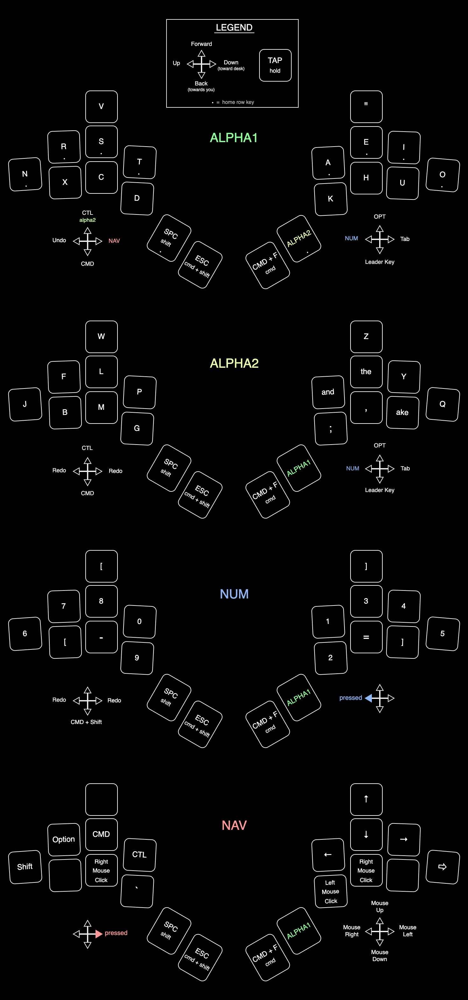

# Fulcrum Keyboard

The Fulcrum Keyboard is an 20-key ergomechanical split keyboard, with two rotary encoders, and two 5-way switches. It runs on KMK circuitpython firmware.

## Description

The original inspiration for such a small number of keys came from Ben Vallack’s "Piano" board. I have made some pretty significant changes from his design, but the core idea of putting several of the alpha keys on a second layer is what drives this board’s design.

The four regular thumb keys are low profile choc switches, and the rest are MX. This is done to accommodate for the fact that your thumb sits on lower plane than the rest of your fingers while typing. In the future I may explore ways to make this height difference even greater.

The rotary encoders are positioned and angled to make them as easy to reach and use as possible. They are right where your hands expect them to be.

The same is true with the 5-way switch joysticks on the thumbs. They are effortless to use. These joysticks are really the defining feature of this keyboard. They open up such a huge field of utility that once you use, it's hard to imagine ever going back to a keyboard that doesn't have them again.

## Firmware

This keyboard runs on KMK firmware, which you can get [here](https://github.com/KMKfw/kmk_firmware). My code.py and kb.py files are in this repo. Feel free to use or alter them as you want.

## Bill Of Materials

| Part      | Quantity | Notes| 
| :-------------- | :---: | :------ |
| nRF52840 Microcontroller | 1 | I recommend either the Adafruit nRF52340 [Itsy Bitsy](https://www.adafruit.com/product/4481) version or the [Feather](https://www.adafruit.com/product/4062) version.|
| Choc key switch | 4 | For thumb keys|
| MX style key switches    | 16 | for non-thumb keys |
| 1N4148 Diodes  | 22 |  | 
| EC11 Rotary Encoders | 2 | EC11 recommended, but you do you|
| 5-Way Switches   | 2 | |
| On/Off switch    | 1 | |
| USB-C Breakout Board   | 1 | (optional)|
| Lipo battery    | 1 | At least 1000 mAh |
| Wire      | -- | Recommend 30AWG or 28AWG|

# Keyboard Features

## 5-Way Switches

This is the most essential and defining feature of the Fulcrum design. Each side has a small 5-way switch joystick, which is mounted sideways so that the top joystick rests against the pad of your thumb as it rests on the "home" thumb key. This provides a wide range of ergonomic movements to utilize on each thumb.

Our thumbs aren't the same as our other fingers (they are “opposable”) so we shouldn’t give them same type of keys as our other fingers.

These joysticks - when mounted sideways - allow you to use your thumbs in a dimension more similar to how they move when typing on a smartphone. They are very capable in this dimension - most people type quite quickly on a smartphone keyboard.

With the regular key switch placed directly below joystick, this actually puts six different actions at the tip of each thumb with very minimal movement. All of these actions are comfortable and easily paired with other key presses elsewhere on the keyboard.

> **Note**
> You should experiment with different functions to find what works for you, but here are some useful tips:
> 1. Pressing "down" (towards the desk) on the joystick should be a layer switch while held. This is because it is the easiest motion to hold while also pressing other keys on the keyboard.
> 2. The most awkward movement is pushing them "forward" (away from you), so choose what you put there carefully
> 3. Besides "forward", they all handle Mod-Tap functionality very well, so consider assigning a "hold" key and a "tap" key for each direction
> 4.  The first few times you use them, you may find it hard to not move the whole board around a bit when pressing certain directions. This will go away after a day or two of getting used to the movements.

The switches are mounted using an angled platform. It consists of two pieces which clamp around the base of the switch. The whole assembly is then superglued to the top of the case.

There is no precise place to glue this little platform. It is meant to have flexibility there so that you can mount it where it feels comfortable to you. You may want to consider lengthening or shortening the joystick as well. A longer joystick provides extra leverage if your 5-way switch has a high operating force.

## Combos
This keyboard uses a layout with a *significant* number of combos. You don't necessarily have to use as many as I do, but you are going to have to use some no matter what.

The combos are split into two main categories: Keys and Words. For the most part, you probably need to keep the Key combos while the Word combos are more optional.

If you want to add more combos, you will have to delete some that are already there, as the firmware is basically operating at it's limit right now.

## Word Keys
In addition to having combos for certain words, there are also a couple words that get their own dedicated keys in this layout. 

We type the words "the" and "and" a lot. Even more-so when you count them when they appear as part of another word (*the*m, *the*y, or ano*the*r). So this keyboard just gives them their own keys. You will be surprised how much time this saves! Feel great and efficient to type with them. 

The Word Keys are on the "alpha2" layer. You can see them all the layers in the keymap at the bottom of this page.

## Optional key risers
Most keys have optional risers to help them conform to the shape of your hand. Every non-thumb key gets them except the bottom two on the middle finger. The top middle finger key gets a slanted riser.  

To use them, print the top plate of the case as normal, and just superglue the risers on top. The switches should friction fit into the risers.

## Rotary Encoders
I find rotary encoders to be very useful, so this keyboard includes two of them. Similarly to the key risers, the encoders use an extra "cap" to angle and raise the encoders so that they sit in a more ergonomic position and give a little extra clearance underneath in the low-profile case.

## Wiring
While this is a split keyboard, I have chosen to hard-wire the halves together. You can follow my wiring if you'd like, or if you want to use a TRRS cable to connect the halves, KMK does offer I2C connection functionality.

## Hotswap Sockets
There is no PCB for this keyboard, it is a hand-wired build. But we all still want hot swap sockets so I've made printable socket holders that allow you to still change out the key switches as you want. You can find both the MX & Choc versions [here](https://www.printables.com/model/284057-hot-swap-socket-holders). 

---

# Layer Keymaps
(blank spaces on joystick directions inherit the key from the previous layer)

